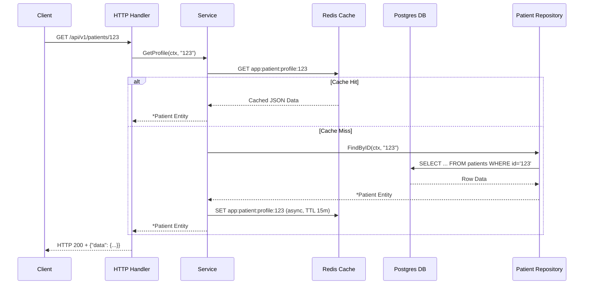

# Blueprint: Modular Monolith Go — Clinic Management System with Redis, RabbitMQ, and Transactional Outbox

> **Version Note:** All code examples in this document reference the actual codebase in this repository. Import paths, function names, and data types match the real implementation (`github.com/sabiqazhar/clinic-monolith`). Dependency injection uses **goforj/wire**, matching the setup in `cmd/api/wire.go`.

> Resource document: this blueprint based on this document: <https://docs.google.com/document/d/1LoRH1hm9pP3eqp8qebCa9D429FL-J3IdufBRebyWW9c/edit?usp=sharing>
---

## Core Architecture: Project Structure and Naming Conventions

A modular monolith is a pragmatic approach to building large applications that run as a single deployable unit, but are organized into strong, isolated modules with clear business boundaries. The approach is designed to capture the main benefits of microservices — independent team ownership, testability, and independent evolution — without inheriting the significant operational complexity of distributed systems, such as network management, cross-service observability, and complex deployments. In the context of a clinic management system, this architecture enables the development of specific features like patient management, appointments, medical records, and pharmacy as coherent, self-contained entities within a single managed codebase.

The foundation of the modular monolith architecture is the application of Domain-Driven Design (DDD) principles, specifically the "Bounded Context" concept. Each Bounded Context represents a well-defined business subdomain where there is a shared language (ubiquitous language) used by domain experts and engineers to describe the business model in a unique and unambiguous way.

Here is the actual project structure used in this codebase:

```text
/clinic-monolith
├── cmd/api/
│   ├── main.go                     # App bootstrap: load config, init infra, graceful shutdown
│   ├── wire.go                     # Wire injector declarations
│   └── wire_gen.go                 # Generated DI wiring (DO NOT EDIT)
├── internal/
│   ├── config/                     # Environment config loader
│   ├── infrastructure/
│   │   ├── db/                     # PostgreSQL & MySQL connection constructors
│   │   ├── cache/                  # Redis client adapter
│   │   └── broker/                 # RabbitMQ + outbox relay
│   └── modules/                    # BOUNDED CONTEXTS (STRICT ISOLATION)
│       ├── patient/                 # Bounded Context 1: Patient Management
│       │   ├── domain/             # Entities, value objects, domain errors, interfaces
│       │   ├── handler/            # HTTP handlers, payload validation, DTO mapping
│       │   ├── service/            # Business logic, cache orchestration
│       │   ├── repository/         # Data access implementation
│       │   │   └── query/           # sqlc-generated queries
│       │   └── provider.go         # Wire provider set
│       ├── billing/                 # Bounded Context 2: Billing
│       │   ├── domain/
│       │   ├── handler/
│       │   ├── service/
│       │   ├── repository/
│       │   │   └── query/
│       │   ├── provider.go
│       │   └── subscriber/          # Event consumer (listens to patient events)
│       └── appointment/             # Bounded Context 3: Appointment
│           ├── domain/
│           ├── handler/
│           ├── service/
│           ├── repository/
│           │   └── query/
│           ├── provider.go
│           └── subscriber/
├── contracts/                      # SHARED EVENT CONTRACTS
│   └── events/v1/
│       ├── patient.go              # PatientRegisteredV1, etc.
│       ├── billing.go               # InvoiceCreatedV1, etc.
│       └── appointment.go          # AppointmentScheduledV1, etc.
├── migrations/
│   ├── postgres/                   # Patient + Billing tables
│   └── mysql/                       # Appointment tables
├── sqlc.yaml                        # sqlc generation config
├── docker-compose.yaml              # Local infrastructure
├── Makefile                        # Migration helpers + module scaffold
└── go.mod
```

Each module under `internal/modules/` has the following key sub-packages:

- **`domain/`**: Contains all fundamental contracts for the context: entities, value objects, domain errors (e.g., `ErrPatientNotFound`), and service and repository interfaces (e.g., `PatientRepository`, `AppointmentService`). This is the only place where the public contract for the module is defined.
- **`handler/`**: Responsible for HTTP interaction with the outside world. Its job is to capture requests, validate payloads, call the service layer, and format responses.
- **`service/`**: The brain of business logic. This is where business transactions are executed, coordination between repositories happens, and orchestration logic (such as caching) is processed.
- **`repository/`**: Contains concrete implementations of repository interfaces defined in `domain/`. Separates business logic from data storage mechanisms.
- **`publisher/`**: Contains logic for publishing events to the message broker.
- **`subscriber/`**: Contains logic for listening to and handling events from the message broker.

The most important isolation rule: **absolutely prohibit direct imports between `modules/*/service/` or `modules/*/repository/`**. Cross-module communication must go through domain interfaces defined in `domain/` or through events published to the message broker.

### Naming Conventions

| Component | Convention | Example |
| :--- | :--- | :--- |
| **Packages** | Single noun, lowercase, no underscores | `patient`, `appointment`, `postgres`, `broker` |
| **Interfaces** | No `I` prefix. End with role/function. | `PatientService`, `PatientRepository`, `EventPublisher` |
| **Variables/Functions** | `camelCase` (unexported), `PascalCase` (exported) | `findPatientByID`, `ValidatePayload`, `HandleError` |
| **Redis Keys** | Structured namespace: `app:module:entity:identifier` | `app:patient:profile:pmt_8x9f2a` |
| **Broker Topics/Queues** | Dot notation: `app.module.event_type.version` | `app.appointment.scheduled.v1` |
| **DB Tables** | `plural_snake_case`. Prefix with module name if using shared schema. | `patient_profiles`, `appointment_slots` |
| **Context Keys** | Use struct type for context keys, avoid string literals | `type ctxKey int; const ctxKeyRequestID ctxKey = 1` |
| **Errors** | Prefix with `Err` and be domain-specific. | `domain.ErrPatientNotFound`, `ErrInvalidCoordinates` |

---

## Dependency Injection Guide with goforj/wire

This section explains how dependency injection is configured using **`goforj/wire`** in this codebase. Wire is a compile-time DI tool that generates wiring code in `wire_gen.go`. No runtime reflection, no overhead.

### Core Principles

Wire DI in Go works with simple rules:

1. Every component (repository, service, handler) has a `New...` constructor that accepts dependencies as parameters.
2. Each module defines a `provider.go` that exports `wire.NewSet(...)` containing all providers.
3. `wire.go` defines an injector function that accepts config values as parameters.
4. Wire analyzes the dependency graph and generates `wire_gen.go` when `go generate` is run.

Correct initialization order: **Infrastructure → Repository → Service → Handler → Router**

### Step 1: Constructor Functions (Wire Providers)

Each layer must have a `New...` function that receives dependencies as parameters — this is **Inversion of Control**. Wire uses these as providers.

**Repository** (receives database pool):

```go
// internal/modules/patient/repository/patient.go
package repository

import (
    "github.com/jackc/pgx/v5/pgxpool"
    "github.com/sabiqazhar/clinic-monolith/internal/modules/patient/domain"
    "go.uber.org/zap"
)

type pgRepo struct {
    db  *pgxpool.Pool
    q   query.Querier    // sqlc-generated querier
    log *zap.Logger
}

// NewPatientRepo is a Wire provider — receives dependencies, returns interface
func NewPatientRepo(db *pgxpool.Pool, log *zap.Logger) domain.PatientRepository {
    return &pgRepo{
        db:  db,
        q:   query.New(db),
        log: log,
    }
}
```

**Service** (receives repository + cache + event publisher):

```go
// internal/modules/patient/service/patient.go
package service

import (
    "github.com/sabiqazhar/clinic-monolith/internal/modules/patient/domain"
    "go.uber.org/zap"
)

type patientService struct {
    repo  domain.PatientRepository
    cache domain.CacheManager
    pub   domain.EventPublisher
    log   *zap.Logger
}

// NewPatientService is a Wire provider
func NewPatientService(
    repo domain.PatientRepository,
    cache domain.CacheManager,
    pub domain.EventPublisher,
    log *zap.Logger,
) domain.PatientService {
    return &patientService{repo: repo, cache: cache, pub: pub, log: log}
}
```

**Handler** (receives service):

```go
// internal/modules/patient/handler/patient.go
package handler

import (
    "github.com/sabiqazhar/clinic-monolith/internal/modules/patient/domain"
    "go.uber.org/zap"
)

type PatientHandler struct {
    svc domain.PatientService
    log *zap.Logger
}

// NewPatientHandler is a Wire provider
func NewPatientHandler(svc domain.PatientService, log *zap.Logger) *PatientHandler {
    return &PatientHandler{svc: svc, log: log}
}
```

### Step 2: Provider Sets per Module

Wire uses provider sets to group all constructors for a module. Each module has a `provider.go` file that exports a `wire.NewSet`:

```go
// internal/modules/patient/provider.go
package patient

import (
    "github.com/goforj/wire"
    "github.com/sabiqazhar/clinic-monolith/internal/modules/patient/handler"
    "github.com/sabiqazhar/clinic-monolith/internal/modules/patient/repository"
    "github.com/sabiqazhar/clinic-monolith/internal/modules/patient/service"
)

var PatientSet = wire.NewSet(
    repository.NewPatientRepo,
    service.NewPatientService,
    handler.NewPatientHandler,
)
```

The `Set` is referenced in the injector so Wire knows the dependency graph:

```go
// cmd/api/wire.go
wire.Build(
    // Infrastructure
    db.NewPostgresPool,
    db.NewMySQLDB,
    cache.NewRedisClient,
    broker.NewRabbitMQ,

    // Adapters
    newCacheAdapter,
    newPublisherAdapter,

    // Interface bindings
    wire.Bind(new(patientdomain.CacheManager), new(*cacheAdapter)),
    wire.Bind(new(patientdomain.EventPublisher), new(*publisherAdapter)),

    // Module providers
    patient.PatientSet,
    billing.BillingSet,
    appointment.AppointmentSet,

    // App struct
    wire.Struct(new(App), "*"),
)
```

Run `go generate` to regenerate `wire_gen.go`:

```bash
go generate ./cmd/api
```

### Step 3: Wire in `cmd/api/main.go`

The actual `main.go` handles infrastructure initialization, calls the Wire-generated `InitializeApp()`, starts background workers, mounts routes, and implements graceful shutdown.

```go
// cmd/api/main.go
package main

import (
    "context"
    "net/http"
    "os"
    "os/signal"
    "syscall"
    "time"

    _ "github.com/go-sql-driver/mysql"     // side-effect import
    _ "github.com/jackc/pgx/v5/stdlib"  // side-effect import
    _ "net/http/pprof"                   // pprof import

    "github.com/gin-gonic/gin"
    "github.com/joho/godotenv"
    "go.uber.org/zap"

    "github.com/sabiqazhar/clinic-monolith/internal/config"
    "github.com/sabiqazhar/clinic-monolith/internal/infrastructure/broker"
    "github.com/sabiqazhar/clinic-monolith/internal/infrastructure/cache"
    "github.com/sabiqazhar/clinic-monolith/internal/infrastructure/db"
)

func main() {
    _ = godotenv.Load() // Load .env if exists

    // Structured JSON logger
    logger, _ := zap.NewProduction()
    defer logger.Sync()

    cfg := config.Load()

    // pprof on separate port (observability isolation)
    go func() {
        logger.Info("pprof listening on :6060")
        if err := http.ListenAndServe(":6060", nil); err != nil {
            logger.Error("pprof failed", zap.Error(err))
        }
    }()

    // Infrastructure: PostgreSQL (patient + billing)
    coreDB, err := db.NewPostgresPool(db.PGDsn(cfg.PostgresURL))
    if err != nil {
        logger.Fatal("postgres init failed", zap.Error(err))
    }
    defer coreDB.Close()

    // Infrastructure: MySQL (appointment)
    apptDB, err := db.NewMySQLDB(db.MySQLDsn(cfg.MysqlURL))
    if err != nil {
        logger.Fatal("mysql init failed", zap.Error(err))
    }
    defer apptDB.Close()

    // Infrastructure: RabbitMQ
    rabbitMQ, err := broker.NewRabbitMQ(broker.RabbitURL(cfg.RabbitMQURL), logger)
    if err != nil {
        logger.Fatal("rabbitmq init failed", zap.Error(err))
    }
    defer rabbitMQ.Stop()

    // Wire DI: build all repositories → services → handlers
    app, err := InitializeApp(
        db.PGDsn(cfg.PostgresURL),
        db.MySQLDsn(cfg.MysqlURL),
        cache.RedisAddr(config.BuildRedisAddr()),
        broker.RabbitURL(cfg.RabbitMQURL),
        logger,
    )
    if err != nil {
        logger.Fatal("wire initialization failed", zap.Error(err))
    }

    // Background workers: outbox relay (per database)
    ctx, cancel := context.WithCancel(context.Background())
    defer cancel()

    go broker.NewOutboxRelay(coreDB, rabbitMQ, logger).Start(ctx)
    go broker.NewOutboxRelay(apptDB, rabbitMQ, logger).Start(ctx)

    // HTTP routes: Handler Self-Registration Pattern
    gin.SetMode(gin.ReleaseMode)
    r := gin.Default()
    v1 := r.Group("/api/v1")
    app.PatientHandler.RegisterRoutes(v1.Group("/patients"))
    app.BillingHandler.RegisterRoutes(v1.Group("/billing"))

    r.GET("/healthz", func(c *gin.Context) {
        c.JSON(http.StatusOK, gin.H{"status": "ok"})
    })

    // Graceful shutdown
    srv := &http.Server{Addr: cfg.ServerPort, Handler: r}
    go func() {
        if err := srv.ListenAndServe(); err != nil && err != http.ErrServerClosed {
            logger.Fatal("server error", zap.Error(err))
        }
    }()

    quit := make(chan os.Signal, 1)
    signal.Notify(quit, syscall.SIGINT, syscall.SIGTERM)
    <-quit

    logger.Info("shutting down server...")
    cancel()
    shutdownCtx, shutdownCancel := context.WithTimeout(context.Background(), 30*time.Second)
    defer shutdownCancel()
    srv.Shutdown(shutdownCtx)
    logger.Info("server exited cleanly")
}
```

### Step 4: Cross-Module Communication (Synchronous)

When one module needs another module's service (e.g., Billing needs to validate Patient), inject the **interface from `domain/`**, not the concrete struct.

**Billing Service** injecting Patient Service interface:

```go
// internal/modules/billing/service/billing.go
package service

import (
    patientdomain "github.com/sabiqazhar/clinic-monolith/internal/modules/patient/domain"
    "github.com/sabiqazhar/clinic-monolith/internal/modules/billing/domain"
    "go.uber.org/zap"
)

type billingService struct {
    repo       domain.InvoiceRepository
    patientSvc patientdomain.PatientService // Interface from patient/domain!
    cache      domain.CacheManager
    pub        domain.EventPublisher
    log        *zap.Logger
}

func NewBillingService(
    repo domain.InvoiceRepository,
    patientSvc patientdomain.PatientService, // Inject interface, not concrete
    cache domain.CacheManager,
    pub domain.EventPublisher,
    log *zap.Logger,
) domain.BillingService {
    return &billingService{
        repo:       repo,
        patientSvc: patientSvc,
        cache:      cache,
        pub:        pub,
        log:        log,
    }
}

func (s *billingService) GenerateInvoice(ctx context.Context, patientID string, amount float64, description string) (*domain.Invoice, error) {
    // SYNC CALL: Validate patient via interface
    if _, err := s.patientSvc.GetProfile(ctx, patientID); err != nil {
        return nil, fmt.Errorf("%w: %v", domain.ErrInvalidPatient, err)
    }
    // ... continue business logic
}
```

The key rule: **Never import `modules/*/service/` directly from another module.** Only import the interface from `domain/`.

### Comparison: Wire vs Manual DI

This codebase uses **goforj/wire** (a fork of google/wire). Here's the comparison:

| Aspect | goforj/wire | Manual DI |
| :--- | :--- | :--- |
| **Setup** | Install `wire` CLI, create `wire.go`, run `wire ./...` | No extra tool needed |
| **Code generation** | Yes — produces `wire_gen.go` | None |
| **Dependency graph** | Analyzed automatically by Wire | Written explicitly in `main.go` |
| **Error detection** | At compile (after `wire gen`) | At compile (directly) |
| **Circular dependency** | Detected by Wire at generate time | Detected by Go compiler directly |
| **Readability** | Need to read `wire.go` + `wire_gen.go` | Read `main.go` directly |
| **Onboarding** | Need to understand Wire providers/injectors | Just regular Go |
| **Best for** | Large projects (50+ components) | Small to medium projects |

**This project uses Wire** (`goforj/wire`) because:

- Compile-time DI with explicit provider sets per module
- No runtime reflection overhead
- Clear dependency graph via `provider.go` files
- Generated code (`wire_gen.go`) is checked into version control

---

## Data Management: Redis Caching and Multi-Database

### Redis Cache Integration

Redis is integrated via `internal/infrastructure/cache/`. This is where the Redis client is initialized, serialization is configured, and key naming logic is implemented.

**Key format:** `app:module:entity:identifier`, for example `app:patient:profile:pmt_8x9f2a`.

The primary design pattern is **Cache-Aside** (implemented in service layer):

1. Try to get data from Redis first (cache lookup)
2. If **cache hit**, return data without touching DB
3. If **cache miss**, query PostgreSQL/MySQL, then write to Redis asynchronously (fire-and-forget goroutine) with 15-minute TTL

For stronger consistency, use **event-based invalidation**: when data changes, modules publish events (e.g., `PatientUpdated`) via Transactional Outbox to RabbitMQ. Listeners can actively delete related keys from Redis using `DEL`.

### Multi-Database Architecture

This project uses a **split-database** design:

| Module | Database | Port | Schema |
|--------|----------|------|--------|
| `patient` | PostgreSQL | 5432 | `public` |
| `billing` | PostgreSQL | 5432 | `public` |
| `appointment` | MySQL | 3306 | (default) |

Each module owns its own tables. No cross-database joins allowed. If one module needs data from another, it must call the other module's public API or consume events.

Database connections are managed in `internal/infrastructure/db/`:

- `postgres.go` — PostgreSQL pool constructor
- `mysql.go` — MySQL connection constructor

All schemas are managed via migrations in `migrations/` using golang-migrate.

---

## Module Communication Patterns: Sync vs. Async

This project uses two communication patterns: **sync** for low-latency critical interactions, and **async** for cross-module state changes.

### Synchronous Communication via DI

Used when immediate response is required and it's part of the critical business logic path. The key pattern: **Module A imports only the interface from `domain/` of Module B**, not the concrete implementation. Wire handles the binding in `wire.go`.

Correct dependency flow: `main.go` → Interface (`domain/`) → Concrete (`service/`, `repository/`)

Real example: Appointment service calls Patient Service synchronously, then saves with outbox:

```go
// internal/modules/appointment/service/appointment.go
package service

import (
    "time"
    "github.com/google/uuid"
    patientdomain "github.com/sabiqazhar/clinic-monolith/internal/modules/patient/domain"
    "github.com/sabiqazhar/clinic-monolith/internal/modules/appointment/domain"
    v1 "github.com/sabiqazhar/clinic-monolith/contracts/events/v1"
    "go.uber.org/zap"
)

type appointmentService struct {
    repo       domain.AppointmentRepository
    patientSvc patientdomain.PatientService // Sync call via interface
    pub        domain.EventPublisher
    log        *zap.Logger
}

func (s *appointmentService) Schedule(ctx context.Context, patientID, doctorID string, scheduledAt time.Time) (*domain.Appointment, error) {
    // 1. SYNC: Validate patient via interface (no import to patient/service!)
    if _, err := s.patientSvc.GetProfile(ctx, patientID); err != nil {
        return nil, fmt.Errorf("%w: %v", domain.ErrInvalidPatient, err)
    }

    appt := &domain.Appointment{
        ID:          uuid.New().String(),
        PatientID:   patientID,
        DoctorID:    doctorID,
        ScheduledAt: scheduledAt,
        Status:      "scheduled",
        CreatedAt:   time.Now(),
    }

    // 2. ATOMIC: Insert appointment + outbox event in 1 transaction
    if err := s.repo.CreateWithOutbox(ctx, appt); err != nil {
        return nil, fmt.Errorf("failed to schedule: %w", err)
    }

    // 3. ASYNC: Event published by OutboxRelay worker (fire-and-forget)
    payload, _ := json.Marshal(v1.AppointmentScheduledV1{
        AppointmentID: appt.ID,
        PatientID:     appt.PatientID,
        DoctorID:      appt.DoctorID,
        ScheduledAt:   appt.ScheduledAt,
    })
    s.pub.PublishEventAsync(ctx, "app.appointment.scheduled.v1", payload)

    return appt, nil
}
```

### Asynchronous Communication via Transactional Outbox

For state changes that don't need immediate response, use the **Transactional Outbox** pattern with RabbitMQ:

1. Service writes to main table + outbox table in the **same DB transaction**
2. Background relay worker reads outbox and publishes to RabbitMQ
3. Other modules subscribe to relevant topics

Real code from patient repository:

```go
// internal/modules/patient/repository/patient.go
func (r *pgRepo) SaveWithOutbox(ctx context.Context, p *domain.Patient) error {
    tx, err := r.db.Begin(ctx)
    if err != nil {
        return fmt.Errorf("begin tx failed: %w", err)
    }
    defer tx.Rollback(ctx)

    qTx := query.New(tx)

    // 1. Insert patient
    if err := qTx.InsertPatient(ctx, query.InsertPatientParams{
        ID:       p.ID,
        FullName: p.FullName,
        Email:    p.Email,
    }); err != nil {
        return fmt.Errorf("insert patient failed: %w", err)
    }

    // 2. Insert outbox event in SAME transaction
    payload, _ := json.Marshal(v1.PatientRegisteredV1{
        PatientID: p.ID,
        FullName:  p.FullName,
        Email:     p.Email,
    })

    if err := qTx.InsertOutboxEvent(ctx, query.InsertOutboxEventParams{
        ID:      uuid.New().String(),
        Topic:   "app.patient.registered.v1",
        Payload: payload,
    }); err != nil {
        return fmt.Errorf("insert outbox failed: %w", err)
    }

    return tx.Commit(ctx) // Commit both atomically
}
```

Event payloads must match the struct definitions in `contracts/events/v1/` — this ensures all modules share the same data format.

---

## End-to-End Execution Flow: Deep Dive into HTTP Request

Understanding the code execution flow from the moment an HTTP request arrives until the response is returned to the user is key to mastering this architecture. Here's the flow for a common use case: `GET /api/v1/patients/:id`.

### Step 1: HTTP Handler (`handler/patient.go`)

The handler is the entry point for HTTP requests. Its job is minimal: extract URL params, call the service, and format the response.

Real code from the codebase:

```go
// internal/modules/patient/handler/patient.go
package handler

import (
    "errors"
    "net/http"
    "github.com/gin-gonic/gin"
    "github.com/sabiqazhar/clinic-monolith/internal/modules/patient/domain"
    "go.uber.org/zap"
)

type PatientHandler struct {
    svc domain.PatientService
    log *zap.Logger
}

func NewPatientHandler(svc domain.PatientService, log *zap.Logger) *PatientHandler {
    return &PatientHandler{svc: svc, log: log}
}

func (h *PatientHandler) RegisterRoutes(g *gin.RouterGroup) {
    g.GET("/:id", h.GetProfile)
    g.POST("/", h.Register)
}

func (h *PatientHandler) GetProfile(c *gin.Context) {
    id := c.Param("id")
    ctx := c.Request.Context()

    patient, err := h.svc.GetProfile(ctx, id)
    if err != nil {
        if errors.Is(err, domain.ErrPatientNotFound) {
            c.JSON(http.StatusNotFound, gin.H{"error": "patient not found"})
            return
        }
        h.log.Error("failed to get patient profile", zap.String("id", id), zap.Error(err))
        c.JSON(http.StatusInternalServerError, gin.H{"error": "internal server error"})
        return
    }

    c.JSON(http.StatusOK, gin.H{"data": patient})
}
```

Routes are registered in `main.go` via the Handler Self-Registration Pattern:

```go
// cmd/api/main.go
v1 := r.Group("/api/v1")
app.PatientHandler.RegisterRoutes(v1.Group("/patients"))
app.BillingHandler.RegisterRoutes(v1.Group("/billing"))
```

### Step 2: Service Layer (`service/patient.go`)

The service layer is the brain of business logic. This is where the **Cache-Aside** pattern is implemented.

Real code from the codebase:

```go
// internal/modules/patient/service/patient.go
package service

import (
    "context"
    "encoding/json"
    "fmt"
    "time"
    "github.com/sabiqazhar/clinic-monolith/internal/modules/patient/domain"
    "go.uber.org/zap"
)

type patientService struct {
    repo  domain.PatientRepository
    cache domain.CacheManager
    pub   domain.EventPublisher
    log   *zap.Logger
}

func (s *patientService) GetProfile(ctx context.Context, id string) (*domain.Patient, error) {
    cacheKey := fmt.Sprintf("app:patient:profile:%s", id)

    // 1. Cache lookup
    if data, err := s.cache.Get(ctx, cacheKey); err == nil {
        var p domain.Patient
        if err := json.Unmarshal(data, &p); err == nil {
            return &p, nil
        }
    }

    // 2. Cache miss → fallback to DB
    patient, err := s.repo.FindByID(ctx, id)
    if err != nil {
        return nil, fmt.Errorf("patient lookup failed:%w", err)
    }

    // 3. Async cache warming (fire-and-forget goroutine)
    go func() {
        bgCtx, cancel := context.WithTimeout(context.Background(), 2*time.Second)
        defer cancel()

        data, marshalErr := json.Marshal(patient)
        if marshalErr != nil {
            s.log.Error("fail to marshall patient for cache", zap.Error(marshalErr))
            return
        }
        // TTL: 15 minutes
        _ = s.cache.Set(bgCtx, cacheKey, data, 15*time.Minute)
    }()

    return patient, nil
}
```

### Step 3: Repository Layer (`repository/patient.go`)

The repository layer is the only part that knows how to talk to the database. SQL queries are generated by **sqlc**, so this layer just calls the generated querier.

Real code using sqlc-generated queries:

```go
// internal/modules/patient/repository/patient.go
package repository

import (
    "context"
    "fmt"
    "github.com/jackc/pgx/v5/pgxpool"
    "github.com/sabiqazhar/clinic-monolith/internal/modules/patient/domain"
    "github.com/sabiqazhar/clinic-monolith/internal/modules/patient/repository/query"
    "go.uber.org/zap"
)

type pgRepo struct {
    db  *pgxpool.Pool
    q   query.Querier    // sqlc-generated
    log *zap.Logger
}

func NewPatientRepo(db *pgxpool.Pool, log *zap.Logger) domain.PatientRepository {
    return &pgRepo{db: db, q: query.New(db), log: log}
}

func (r *pgRepo) FindByID(ctx context.Context, id string) (*domain.Patient, error) {
    // Query generated by sqlc from queries.sql
    row, err := r.q.FindPatientByID(ctx, id)
    if err != nil {
        if err.Error() == "no rows in result set" {
            return nil, domain.ErrPatientNotFound
        }
        return nil, fmt.Errorf("query failed: %w", err)
    }

    return &domain.Patient{
        ID:       row.ID,
        FullName: row.FullName,
        Email:    row.Email,
    }, nil
}
```

The actual SQL queries live in `.sql` files (`repository/queries.sql`), processed by **sqlc**:

```yaml
# sqlc.yaml
version: "2"
sql:
  - engine: "postgresql"
    schema: "./migrations/postgres"
    queries: "./internal/modules/patient/repository/queries.sql"
    gen:
      go:
        package: "query"
        sql_package: "pgx/v5"
        out: "internal/modules/patient/repository/query"
        emit_interface: true
```

### Step 4: Response Flows Back

1. `repository` returns `*domain.Patient` to `service`
2. `service` receives the data, initiates async cache warming, then returns to `handler`
3. `handler` maps `*domain.Patient` and sends HTTP 200 OK to client



---

## Operational, Observability, and Standards

### Operational Requirements

**Health Checks:** The app provides `/healthz` endpoint for Kubernetes readiness/liveness probes.

- **Readiness Probe:** Verifies all dependencies are available — DB connections, Redis client, RabbitMQ client.
- **Liveness Probe:** Returns HTTP 200 only.

**Graceful Shutdown:** App listens for `SIGINT` and `SIGTERM`:

1. Cancel root context → signals all background workers to stop
2. Allow HTTP server to drain in-flight requests (30 seconds)
3. Close all external connections: DB pools, Redis, RabbitMQ
4. Exit with status code `0`

(See `cmd/api/main.go` for the implementation.)

### Observability

**Structured Logging:** All logs are JSON via `go.uber.org/zap`. Each log includes `request_id` (where available) and module name for cross-module correlation.

```json
{"level":"info","ts":12345,"msg":"Successfully fetched patient profile","module":"patient","request_id":"req-abc-123"}
```

**pprof:** Profiling endpoint at `:6060` for production debugging.

**Metrics:** Not yet implemented, but the architecture supports adding `/metrics` with Prometheus format.

**Tracing:** Not yet implemented, but OpenTelemetry can be added via middleware.

### CI/CD and Code Review

**CI/CD Gates:**

- **Linter:** Use `golangci-lint` for code style and potential bugs
- **Static Analysis:** Run `staticcheck` for deeper analysis
- **Dependency Check:** Use Trivy to scan for vulnerabilities

**Code Review Checklist:**

- [ ] No direct imports between `modules/*/service/` or `modules/*/repository/`
- [ ] All public interfaces defined in `domain/`
- [ ] Redis keys follow namespace format and have clear TTLs
- [ ] Message broker uses versioned payloads in `contracts/`
- [ ] All DB queries use parameterization (sqlc-generated queries are safe)
- [ ] Logging uses `zap` with module name
- [ ] Graceful shutdown implemented
- [ ] No cyclic dependencies

---

## Implementation, Testing, and Future-Proofing

### Practical Implementation

**Dependency Injection with Wire:** All dependency assembly is done via:

- `provider.go` files in each module (defines `wire.NewSet(...)`)
- `wire.go` in `cmd/api` (defines injector + interface bindings)
- Generated `wire_gen.go` via `go generate`

To regenerate after changes:

```bash
go generate ./cmd/api
```

**Makefile Helpers:** Use the Makefile for migrations and module scaffolding:

```bash
make create-module name=inventory   # Scaffold new module
make create-pg name=add_users       # Create PG migration
make create-my name=add_slots       # Create MySQL migration
```

**Consistent Error Handling:** Use `fmt.Errorf("failed to do X: %w", err)` for unwrappable errors. Define domain-specific errors in each module's `domain/` (e.g., `var ErrPatientNotFound = errors.New("patient not found")`). This enables fine-grained error handling in handlers, mapping internal errors to appropriate HTTP status codes.

### Testing Strategy

- **Domain Layer (Unit Test):** Test business logic in entities and value objects. Use mocks if needed.
- **Service Layer (Unit Test with Mocks):** Use `testify/mock` or `gomock` to mock `domain.Repository` and `domain.CacheManager`. This enables isolated service logic testing, e.g., validating Cache-Aside behavior.
- **Repository Layer (Integration Test):** Test against real databases. Use `testcontainers-go` or `dockertest` for temporary DB instances in tests.
- **Handler Layer (HTTP Contract Test):** Test endpoints using `net/http/httptest`. Verify correct status codes, headers, and JSON body.
- **Events Layer (Contract Test):** Ensure payloads published by one module can be deserialized by consumers. Validate payloads match struct definitions in `contracts/`.
- **Multi-Module Integration Test:** Write end-to-end tests involving multiple modules to ensure async communication works.

### Future-Proofing: Microservices Extraction

One of the biggest advantages of modular monolith is that it serves as an excellent foundation for gradual microservices decomposition.

1. **Identify Candidate Modules:** Look for modules with different deployment frequency, different teams, or different scalability needs.
2. **Extract Module:** Move entire module code (`domain/`, `handler/`, `service/`, `repository/`) to a new independent project.
3. **Change Communication:** Replace sync DI calls (e.g., `patientService.Get...`) with remote calls via gRPC or HTTP/JSON.
4. **Event Orchestration:** Adapt event publishing and consumption to become part of a centralized event stream used by all microservices.
5. **Update DI:** After extraction, simply remove the module initialization line from `wire.go` and replace with an HTTP/gRPC client calling the standalone service.

The modular monolith provides time to build products quickly while building a strong, well-defined foundation for the future.
